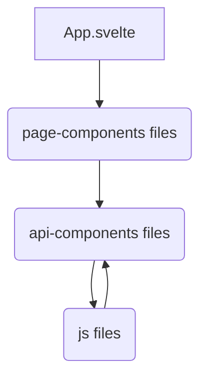
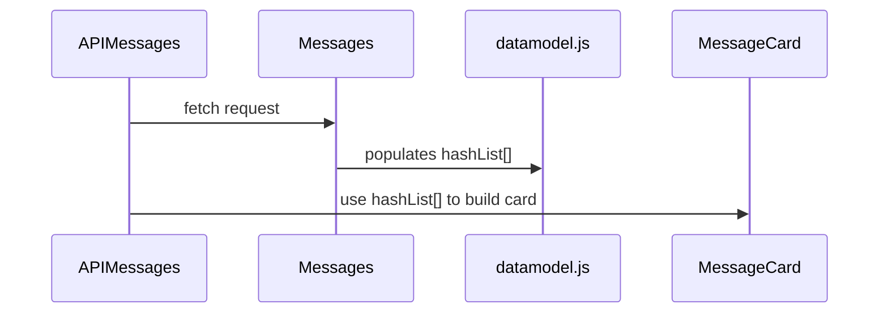
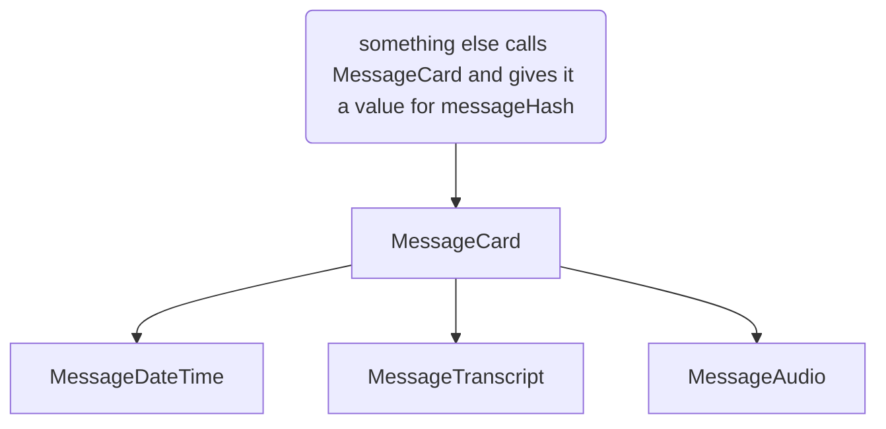
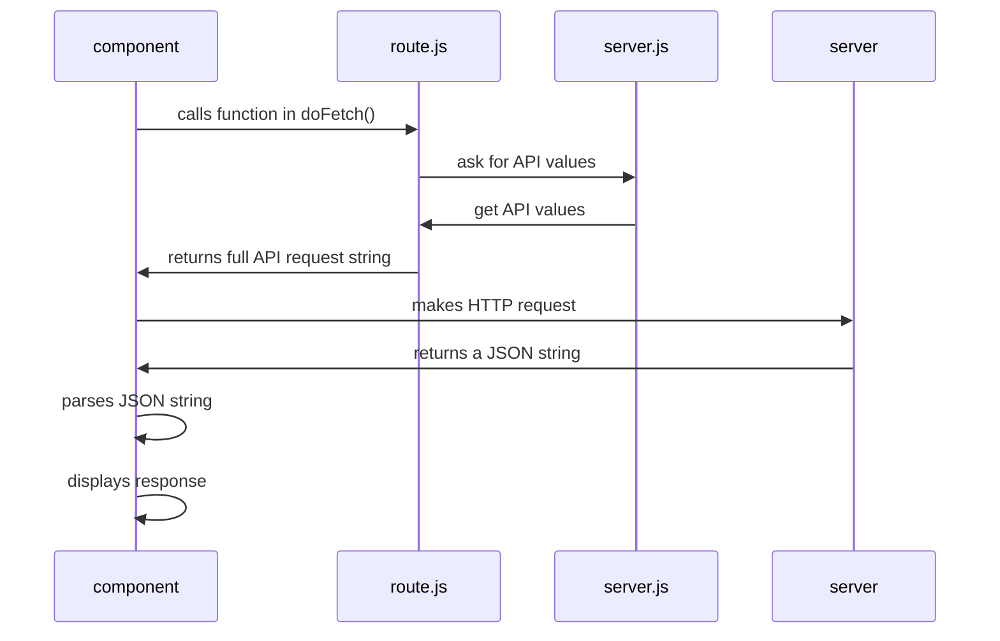

# The Iron Guild

    The Iron Guild is an single page app that displays data from the Malamute API. 

## File Structure

A high level overview of the structure of building svelte pages:


## App.svelte
The page ```App.svelte``` is the first svelte component to be loaded by the browser. In this page, specify the page you want to display.

## Page-Components Files

Create unique front ends in the ```pages``` folder. A page creates structure to data that's fetched in api-component files. No API calls happen in these files, instead this is a place to make CSS design decisions and to outline the data flow. 

This design decouples making API calls from page layout designs. 

## API-Components Files

The folder ```api-components``` has svelte scripts that make an HTTP request to the API. For each route, create an indivdual svelte file to handle this request and make available the data that is returned.  

No CSS styling decisions should happen in these components. 

Data returned should be as simple HTML as possible. A standard implementation would use the await block. 

```js
{#await promise}
    <p>await</p>
{:then value}
    {json value}
{:catch error}
    <p>error</p>
{/await}
```
```MessageAll``` and ```Messages``` do not return HTML code and instead populate unique variables in ```datamodel.js```. This is because their data is meant to be displayed, but is used in a page to inform other API calls that will be hydrated later. 

## JS Files
Edit ```server.js``` for Malamute API updates. This is where the IP address, port, and version number is set. 

Edit ```routes.js``` to add or edit API routes.

Edit ```datamodel.js``` for any information that needs to be stored across pages. Use this only when needed. We prefer to make an API call to get information rather than store it in the app. 


## Flow of hydrating components

Mermaid diagram time!

### The APIMessagesPage
This demostrates how to use datamodel.js to make subsequent API calls. 



### The Message Card component
More data and design can be added to this component.



### A general api-component
This is the general structure for how to fetch data from an API and display it in the component. 



