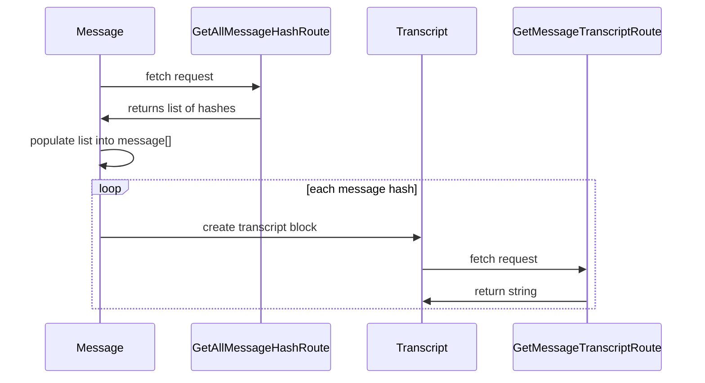

# The Iron Guild

The Iron Guild is an single page app that gets a list of all messages and hydrates them with message data. 

Flow of hydrating components

```mermaid
sequenceDiagram

    Message ->> GetAllMessageHashRoute : fetch request
    GetAllMessageHashRoute ->> Message : returns list of hashes
    Message ->> Message : populate list into message[]
    loop each message hash
     Message ->> Transcript : create transcript block
     Transcript ->> GetMessageTranscriptRoute : fetch request
     GetMessageTranscriptRoute ->> Transcript : return string
    end  
```
